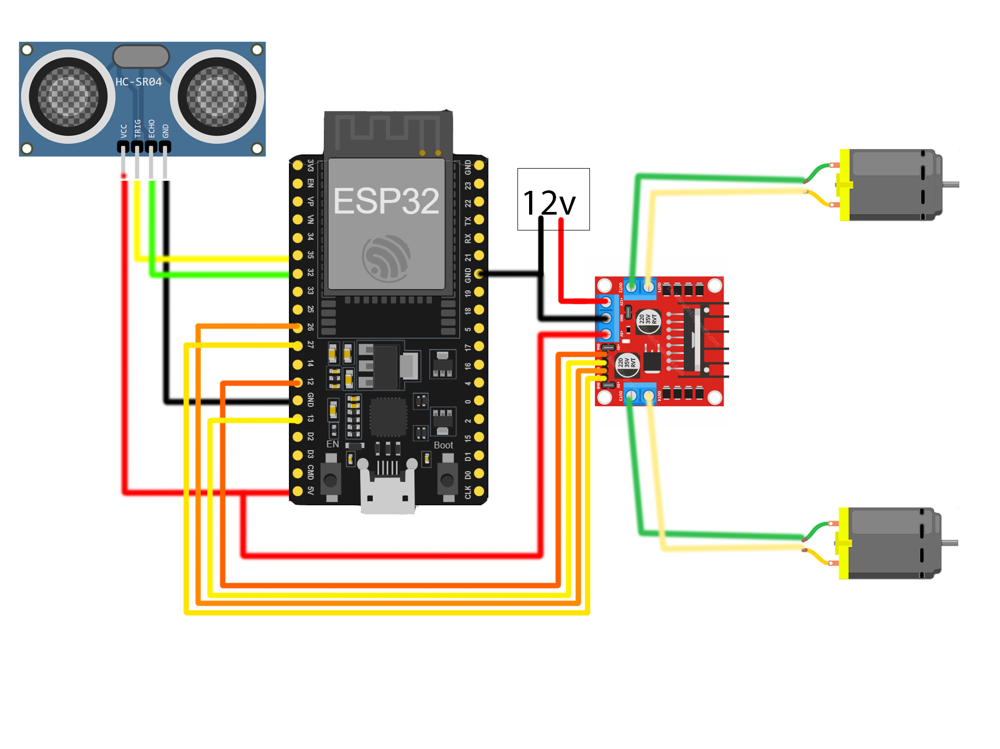

# Bluetooth Controlled Car with Obstacle Avoidance Using ESP32 & L298N Motor Driver

This project enables you to control a robot car via Bluetooth using an Android app, with the added feature of obstacle avoidance. The car is powered by an ESP32 microcontroller, which communicates with an L298N motor driver to control the motors. Additionally, the car can autonomously avoid obstacles using ultrasonic sensors, making it more intelligent and responsive to its environment.

**Components Used**
- ESP32: A powerful microcontroller with built-in Bluetooth and Wi-Fi capabilities.
- L298N Motor Driver: A dual H-Bridge motor driver to control the DC motors.
- DC Motors: Two DC motors to drive the car.
- HC-SR04 Ultrasonic Sensor: For obstacle detection (front of the car).
- Bluetooth: Bluetooth module (built into ESP32).
- Power Supply: Typically a 9V battery or LiPo battery to power both the car and the ESP32.

**Features**
- Bluetooth Control: Use the provided Android app to control the car remotely via Bluetooth.
- Forward, Backward, Left, Right, Stop: The car can be driven forward, backward, turned left, turned right, or stopped.
- Obstacle Avoidance: The car uses an ultrasonic sensor (HC-SR04) to detect obstacles and automatically avoid them by stopping or changing direction.
- Real-time Control: The car responds to your Bluetooth commands in real-time with minimal latency.

**Circuit Diagram**

- **ESP32 to L298N Motor Driver:**

    - IN1 -> GPIO 12
    - IN2 -> GPIO 13
    - IN3 -> GPIO 26
    - IN4 -> GPIO 27
    - ENA -> 5V (or control pin)
    - ENB -> 5V (or control pin)
    - OUT1 & OUT2 -> DC motor 1
    - OUT3 & OUT4 -> DC motor 2
    - VCC -> 5V (for L298N logic)
    - GND -> Ground (shared with ESP32 and battery)

- **ESP32 to HC-SR04 Ultrasonic Sensor:**

    - VCC -> 5V
    - GND -> Ground
    - Trig -> GPIO 33
    - Echo -> GPIO 32
    - Power Supply: Ensure the motors are powered with a separate power source (e.g., 9V battery or LiPo battery).
ESP32 can be powered through the micro USB port.

**Android App**
The provided Android app allows you to control the car's movement via Bluetooth. You can:
Move the car forward, backward, left, or right.
Stop the car.
The app also handles Bluetooth pairing and connection management.

**Code Overview**
Bluetooth Control: The car can be manually driven through the Android app using Bluetooth commands (forward, backward, left, right, stop).
Obstacle Avoidance: The ultrasonic sensor continuously measures the distance to any object in front of the car. If an obstacle is detected within a defined range (e.g., 20 cm), the car will automatically stop to avoid a collision.
Motor Control: The code manages the motor states to drive the car forward, backward, turn, or stop based on Bluetooth inputs and sensor readings.
